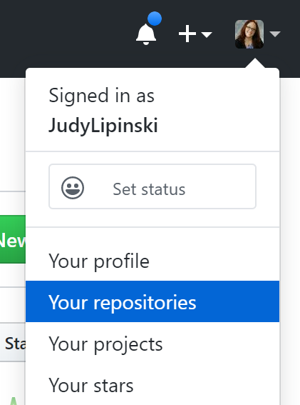
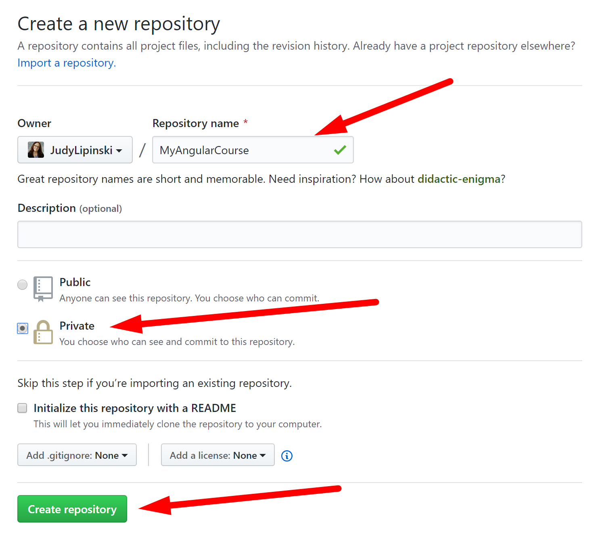
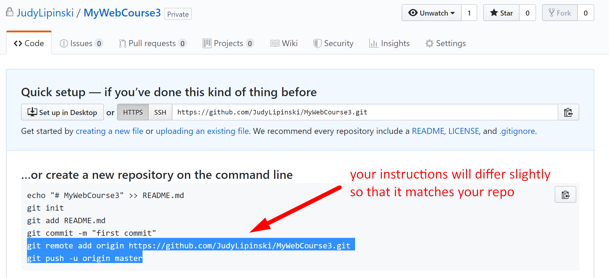
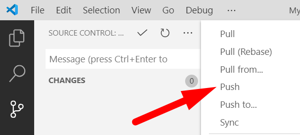

These instructions will help you to setup a remote repository in GitHub that you can push your code to.

### **Part 1 - Add a remote link from your local repo to GitHub**

1. Navigate to https://GitHub.com/ and sign into an existing account of yours or sign up for a new account.

2. After logging into GitHub, open your lst of repositories if it is not currently shown using the drop down in the right top corner.
   
   
3. Open a dialog by the green new button. 

    


4. In the menu that appears: 
* name your new GitHub repository `MyAngularAlbums`
* choose private 
*  Leave the checkbox for **Initialize this repository with a README** unchecked
    

    and click the green button to `Create Repository`

1. GitHub will generate instructions for the remote repo. You only need the last two lines. Yours will be slightly different than what is shown because it will be for your repo. Highlight and copy the last two lines shown to you. 



1.  and paste them into the command prompt in your my-angular-albums directory.


### **Part 2 PUSHING CHANGES TO GITHUB**

    Now you can push your repo to GitHub. The changes you have committed locally will appear in GitHub.
   
    On projects with others involved, always PULL before you PUSH. 
    
1. Click on the `...` button found on top of VS Code's source control panel and choose **Push**.
   

   


2.  VS Code will prompt you to enter your GitHub credentials to push the changes, please do so now. If you navigate to GitHub, you should see the README.md is updated with your changes.

3. To push commited changes, you can also click on the `Synchronize Changes` button found in blue on the bottom left of VS Code. This button will pull changes and then push commits made to the current branch we are on.    

4.  VS Code will continue to ask for your GitHub username and password every time it talks to GitHub. You can use a credential helper shown in the Windows example below:

    On Windows, running the following in the command line will store your credentials:

    ```
    $ git config --global credential.helper manager
    ```
