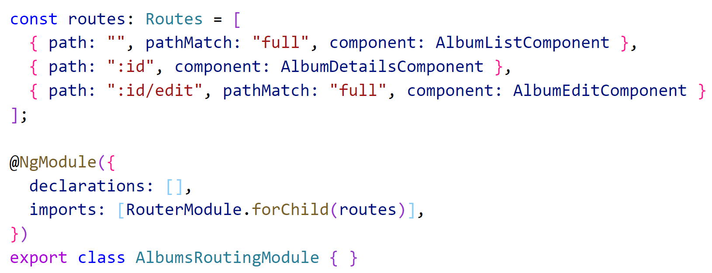

# Chapter 9 Routing: Child Routes 

## Objectives

- Add a Child Route to the detail page
- add another routing-outlet to child

## Steps

1. Continue working in your **my-angular-albums** project. If you haven't completed previous exercises, you can copy the last solution's src directory over your src directory.

1. Create the beginnings of an album edit component using:

    

2. Modify the **album-details.component.html** to include a button to lead to this new component.  Put this at the bottom of the file before the closing div tag. Note the use of router-outlet as well - this is where we want the child content to load.

    

3. Lets try to add the edit route in **AlbumsRoutingModule** by creating another entry that leads to the AlbumEditComponent like shown.

    

1. Test your changes in the browser. List all albums, click on one album's Show details page, then click the edit button at the bottom.

2. You will see the It works! message but not under the current album where we want it. 

    

1. We need to use the children property so that we can target the router outlet.

   Modify your AlbumsRoutingModule by changing the id route to have an additional property have children as shown:

    

1. Now test your app to see that it shows the it works message under the album details, where the second router-outlet was placed.

1.  Mark your work as complete.

## Bonus 

1. Continue work from previous bonuses - and create edit components and buttons for use in your application.